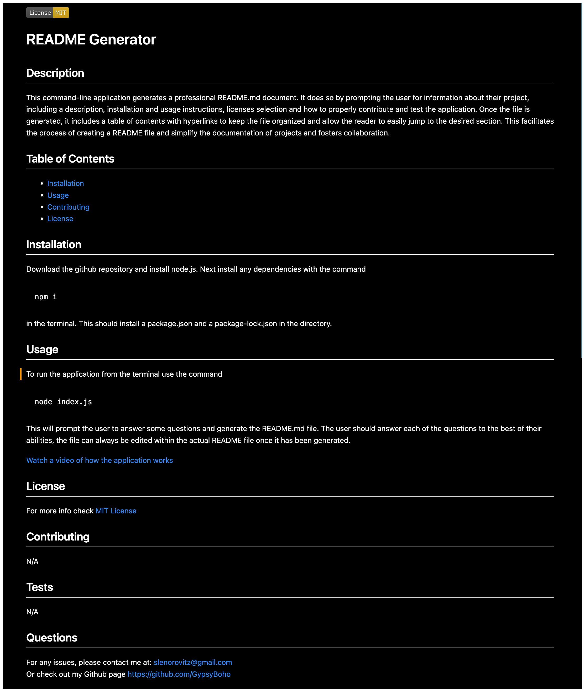

[](https://opensource.org/licenses/MIT)
  # README Generator 

## Description
          
This command-line application generates a professional README.md document. It does so by prompting the user for information about their project, including a description, installation and usage instructions, licenses selection and how to properly contribute and test the application. Once the file is generated, it includes a table of contents with hyperlinks to keep the file organized and allow the reader to easily jump to the desired section. This facilitates the process of creating a README file and simplify the documentation of projects and fosters collaboration. 

Preview of a generated README file


## Table of Contents

* [Installation](#installation)
* [Usage](#usage)
* [Contributing](#contributing)
* [License](#license)

## Installation

Download the github repository and install node.js. Next install any dependencies with the command 
```
npm i
``````
in the terminal. This should install a package.json and a package-lock.json in the directory.

## Usage

To run the application from the terminal use the command
```
node index.js
```
This will prompt the user to answer some questions and generate the README.md file. The user should answer each of the questions to the best of their abilities, the file can always be edited within the actual README file once it has been generated. 

[Watch a video of how the application works](https://drive.google.com/file/d/1zmedQJ2Y1VQtCERbfSwX2Ray6VMadd7Z/preview)

## License

For more info check [MIT License](https://opensource.org/licenses/MIT)
    

## Contributing

N/A

## Tests

N/A


## Questions

For any issues, please contact me at:
slenorovitz@gmail.com
<br>
Or check out my Github page https://github.com/GypsyBoho
